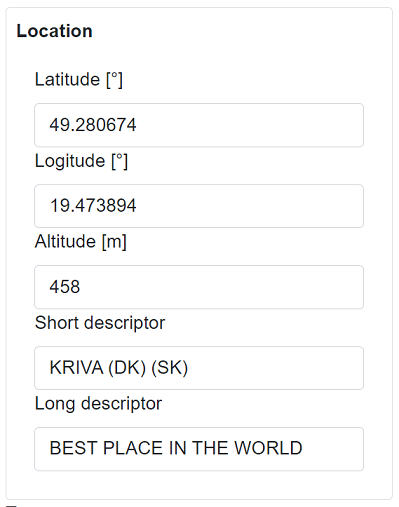

# IX

The **IX** is a series of tools that extend SIMATIC AX (Automation Xpansion) with a flexible and powerful connection with .NET ecosystem. IX includes a compiler (`ixc`) that translates PLC data structures into C# (PLC .NET Twin), which makes the PLC data available in a structured way for any .NET application. Furthermore, presentation libraries provide additional features for the automated rendering of PLC data in the UI/HMI.

## State of the project

This project is under development; however, we are [releasing versions](https://github.com/ix-ax/ix/releases) that you can play with before the release of the full version. This project follows [semantic versioning](https://semver.org/).

All versions released with a major version number `0` (e.g. 0.10.0) can have breaking changes to the previous version at any moment. Stable versions will be released with a major version number greater than `0` (e.g. 1.2.1).

We plan to have production-ready libraries and tools in early spring 2024, that will cover:

- compiler for building .NET twin object (ix compiler)
- communication layer between .NET twin objects and S71500 series PLCs
- user interface generator for Blazor application
- application templates for quick development and deployment.

**Documentation** is a work in progress should you find missing, unclear, or misleading content please feel free to [add an issue](https://github.com/ix-ax/ix/issues/new/choose) or to create a pull request with the fix you find appropriate.

There are some **known issues** that we are looking into in the development process. The list of known issues is [here](https://github.com/ix-ax/ix/issues?q=is%3Aissue+is%3Aopen+label%3Aknown-issue).

**IX** is the underlying technology for the [ix.framework](https://github.com/ix-ax/ix.framework) that will be rendered public in this organization and will provide a series of libraries and components for building automation projects.

## Disclaimer

**It is necessary to have a valid license for SIMATIC AX in order to use IX!**  
SIMATIC AX is currently in a limited sales release in selected European countries only. You will need to request access from the AX team which will check if your use case is suitable for the current state of the product. The first step to getting the approval is contacting your local SIEMENS sales representative or writing an email to [simatic-ax@siemens.com](mailto:simatic-ax@siemens.com?subject=Request%20for%20access%20|%20SIMATIC%20AX%20for%20IX).

## How it works

In simple terms, the IX takes the PLC program and translates the data structured into .NET classes.

### Write PLC code

~~~iecst
{#ix-attr:[Container(Layout.Stack)]}
{#ix-attr:[Group(Layout.GroupBox)]}
{#ix-set:AttributeName = "Location"}
CLASS  GeoLocation
    VAR PUBLIC
        {#ix-set:AttributeName = "Latitude [°]"}
        {#ix-set:AttributeMinimum = -90.0f}
        {#ix-set:AttributeMaximum = 90.0f}
        Latitude : REAL;
        {#ix-set:AttributeName = "Logitude [°]"}
        {#ix-set:AttributeMinimum = 0.0f}
        {#ix-set:AttributeMaximum = 180.0f}
        Longitude : REAL;
        {#ix-set:AttributeName = "Altitude [m]"}
        Altitude : REAL;
        {#ix-set:AttributeName = "Short descriptor"}
        Description : STRING[10];
        {#ix-set:AttributeName = "Long descriptor"}
        LongDescription : STRING[254];
    END_VAR    
END_CLASS
~~~

### Compile to get .NET twin

~~~ C#
using System;
using Ix.Connector;
using Ix.Connector.ValueTypes;
using System.Collections.Generic;

[Container(Layout.Stack)]
[Group(Layout.GroupBox)]
public partial class GeoLocation : Ix.Connector.ITwinObject
{
    public OnlinerReal Latitude { get; }

    public OnlinerReal Longitude { get; }

    public OnlinerReal Altitude { get; }

    public OnlinerString Description { get; }

    public OnlinerString LongDescription { get; }

    --- truncated ----
~~~

You can then access the data in your .NET application

### Use in any .NET application

~~~C#
// Write
await Entry.Plc.weather.GeoLocation.Longitude.SetAsync(10);

// Read
var longitude = await Entry.Plc.weather.GeoLocation.Longitude.GetAsync();

// Bulk read
Entry.Plc.weather.GeoLocation.Read();

// Bulk write
Entry.Plc.weather.GeoLocation.Write();
~~~

### Automatically render in HMI

## Getting started

To get started, visit the documentation [here](docs/README.md#getting-started).

## Examples 

Examples can be found [here](src/ix.examples)

## Contributing

Contributions are welcomed. Have a look at [contributing document](CONTRIBUTING.md).
