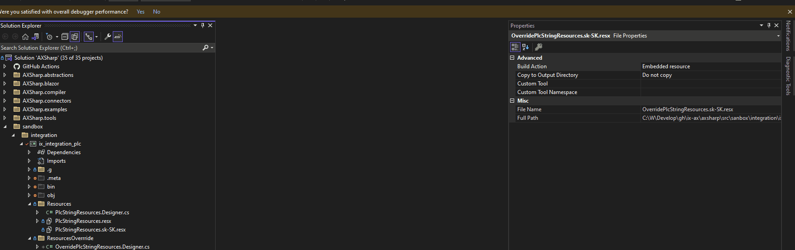

# AXSharp connectors

**AXSharp connectors provide connectivity between twin objects and a target system.**

## Connecting PLC.NET Twin to the PLC

How to create a PLC twin connector have a look at [Getting started](~/index.md#getting-started)


## Accessing PLC data

Each elementary/primitive/base type is represented by twin wrapper objects that are summarily called **Onliners**. Onliners allow for direct access to the PLC variable via 

- `Cyclic`: variable is read or written cyclically in specified periods. 
- `Direct`: variable is read or written to the controller and returns to the application once the operation is performed. 
- `Shadow`: off-line/shadow value holder allows for fast swapping of large bulk of data in a single shot.
- `Batch`: access allows for manipulation and batch read and write of entire structures.

### Cyclic access

**Cyclic access** allows for fast, low-performance cost, two-way access to the PLC variables. Cyclic values are read and written in an optimized periodic loop. The controller twin object contains the entire PLC program, it does not discriminate between the variables and objects that are used by the consumer and those that are not. However, the Cyclic values are accessed via the communication interface only when:

- Twin connector is set to `Auto` subscription, which will set the variable into a cyclic read queue when `Cyclic` property is accessed in the consumer program.
- Twin connector is set to `Polling` subscription, and reading is activated by `StartPolling`.


Primitive Twins implement notification change when the cyclic property changes [INotifyPropertyChanged](https://learn.microsoft.com/en-us/dotnet/api/system.componentmodel.inotifypropertychanged?view=net-7.0). This feature is particularly useful for visualization scenarios in presentation frameworks that support data binding with change notification (WPF, Blazor, WinForm).

> **WARNING** 
> Cyclic access may result in degraded performance when the cyclic loop contains too many cyclically accessed primitive twins. Consider using `polling` instead of `automatic` subscription to balance the communication load.

~~~ C#
    // Cyclic Read
    /*
    Notice that the property Cyclic will return type's default value when called for the first time. First access will only subscribe for the cyclic reading.
    */
    Console.WriteLine($"{Entry.PlcTwin.Counter.Symbol} : {Entry.PlcTwin.Counter.Cyclic}");
    

    // Cyclic Write
    /*
    Notice that the value of the Cyclic will be written to the PLC at the next iteration of the r/w cycle of the connector.
    */
    Entry.PlcTwin.RunCounter.Cyclic = true;
~~~


### Direct access

**Direct access** is two-way access to the PLC variable Variable is accessed via *GetAsync* and *SetAsync* methods for reading and writing, respectively. In contrast to the cyclical access, the variable is either read or written, and only then does the control return to the caller. In other words, the *Direct* allows immediate access to the PLC variable.

~~~ C#
// Synchronous Read
/*
Notice that the method GetAsync in contrast to Cyclic, will return the value from the PLC immediately.
*/
Console.WriteLine($"{Entry.PlcTwin.Counter.Symbol} : {Entry.PlcTwin.MAIN.Counter.GetAsync()}");

// Synchronous Write
/*
Notice that the value of the set by SetAsync in contrast to Cyclic will be written to the PLC immediately.
*/
Entry.PlcTwin.MAIN.RunCounter.SetAsync(true);
~~~

> **NOTE**
> direct access is expensive to use in scenarios when more variables are required to be read or written in the same moment as it performs item-by-item access without any optimization. When you want to mitigate this effect, use batched access instead.

### Batched access

**Batched access** allows you to read or write a group of variables in a single shot. Strictly speaking, batched reading and writing are the operations that are performed with TwinObjects.There are several ways to access the data in a batched way. The easiest and the most straightforward way is to use methods *Read()*, or *Write()*, which are extension methods for *ITwinObject*. All variables contained in the structure are read or written when *Read()* or *Write()* methods are used, respectively.

During the batched read operation, the values are stored in *LastValue* property of the corresponding Primitive Twin.

During a batched write operation, the values written to the controller were retrieved from the *Cyclic* property of the corresponding Primitive Twin.

> **NOTE** 
> Accessing *Cyclic* property for **writing** will not result in an autmatic subscription for cyclic reading. Acessing the *LastValue* property will neither result in an automatic subcription for reading.

~~~ C#
// in this namespace are extension methods for batched operations.
using AXSharp.Connector;

public class BatchedAccess
{
    public async Task ReadBatched()
    {
        // Reads whole structure settings
       await Entry.PlcTwin.Settings.ReadAsync();

        // Write values to the console
        Console.WriteLine($"{Entry.PlcTwin.Settings.PosX.Symbol}:{Entry.PlcTwin.MAIN.Settings.PosX.LastValue});

        Console.WriteLine($"{Entry.PlcTwin.Settings.PosY.Symbol}:{Entry.PlcTwin.Settings.PosY.LastValue});

        Console.WriteLine($"{Entry.PlcTwin.Settings.PosZ.Symbol}:{Entry.PlcTwin.Settings.PosZ.LastValue});
    }


    public async Task WriteBatched()
    {
       Entry.PlcTwin.Settings.PosX.Cyclic = 100.0f;
       Entry.PlcTwin.Settings.PosY.Cyclic = 120.0f;
       Entry.PlcTwin.Settings.PosZ.Cyclic = 130.0f;

        // Writes all values of the settings structure.
       await Entry.PlcController.MAIN.Settings.WriteAsynch();
    }
}
~~~

Polling allows an application to query a structure or variable at different intervals. The values are stored in the `Cyclic` property of value types. The polled variables are retrieved from the controller in the same way as during cyclic reading but at a specified interval. Unlike automatic subscription mode, the polled values can be unsubscribed.

To enable polling, the subscription of the twin connector must be set to `Polling`.

```C#
Entry.Plc.Connector.SubscriptionMode = ReadSubscriptionMode.Polling;
Entry.Plc.Connector.BuildAndStart();
```

> **WARNING** 
> The subscription mechanism must be selected at the application's start-up before any operation on the twin connector. Mixing subscription modes during the lifetime of the application may result in inconsistent behavior.

### Starting Polling

To start polling a structure at a given interval, use the `StartPolling` method with an interval in milliseconds. `StartPolling` is an extension method, so remember to import the `AXSharp.Connector` namespace.

```C#
using AXSharp.Connector;
.
.

Entry.Plc.Settings.StartPolling(50);
```

### Stopping Polling 

To stop polling, call the `StopPolling` method on the structure you want to stop polling. `StopPolling` is also an extension method, so remember to import the `AXSharp.Connector` namespace.

```C#
using AXSharp.Connector;
.
.

Entry.Plc.Settings.StopPolling();
```

See also

[Polling in Blazor application](../blazor/RENDERABLECONTENT.md#renderable-content-control-polling)


## Swapping data between Online and Shadow

Shadows are off-line value holders. Each primitive type has a shadow property. This property only affects the Online values if explicitly instructed to do so by the program. Shadows are helpful when we need to modify multiple values, but we need to send them into the PLC in one shot.

### Sending data from online to shadow

~~~C#
// This will copy the values of the `monster` structure from the controller into the shadow value holder.
await monster.OnlineToShadowAsync();
~~~

### Sending data from shadow to online

~~~C#
// This will copy the value from the shadow value holders of `monster` structure into the controller.
await monster.ShadowToOnlineAsync();
~~~

See also

[Rendering onliners and shadows in a blazor application](../blazor/RENDERABLECONTENT.md#presentation-types)

## Using POCO / Plain object

Onliners are somewhat heavy objects that are well suited for communication with the controller, but they carry too much information that are a burden in some use cases. AXSharp compiler, therefore, creates `Plain/POCO` objects that are light CLR (C#) objects that can retrieve and send data from and to the controller.

### Getting POCO object

~~~C#
// This will read, populate and return the plain object of `monster` class from `online` values of the controller.
var plainOnline = await monster.OnlineToPlainAsync();

// This will read, populate and return the plain object of `monster` class from the shadow values of the controller.
var plainShadow = await monster.ShadowToPlainAsync();
~~~

### Writing POCO object

~~~C#
// This will write the content of the plain object to the controller.
await monster.PlainToOnlineAsync(plainOnline);

// This will write the content of the plain object to the shadows of the controller.
await monster.PlainToShadowAsync(plainShadow);
~~~

>[!NOTE]
> There are also type agnostic methods available over [ITwinObject](~/api/AXSharp.Connector.ITwinObject.yml) interface.

----
## Other useful properties of Primitive Twins

Let's have a simple program
```BASIC
PROGRAM MAIN
VAR_EXTERNAL
    {attribute addProperty Name "<#App#>" }
    _app : fbApp;
END_VAR
---
CLASS PUBLIC fbApp
VAR PUBLIC
    {#ix-set:AttributeName "<#Settings#>" }
    settings : stSettings;
END_VAR
---
TYPE stSettings :
    STRUCT
        {#ix-set:AttributeName "<#Lights off#>" }
        TurnLightsOff :BOOL;
    END_STRUCT
END_TYPE

```

### Symbol

The symbol is readonly property that is the symbolic representation of the variable in the PLC program.

The symbol for `TurnLightsOff` is `_app.settings.TurnLightsOff` 

### AttributeName

AttributeName is the default [added member](../compiler/ADDED_MEMBERS.md) of all objects in generated by `ixc` (AXSharp compiler). They are used to represent the name of the variable or object in a user-friendly way. These attributes can be later used to label the variables consistently in the UI.

AttributeName for `TurnLightsOff` is `Lights off` . Text inside tags `<#` and `#>` is marked as LocalizedString. They are optional.

### AttributeUnits

AttributeUnit is the default [added property](../compiler/ADDED_MEMBERS.md) of all PrimitiveTwins generated by `ixc` (AXSharp compiler). They are used to represent the unit of measure of the variable.

~~~
{#ix-set:AttributeUnits "mm" }
_length : REAL;
~~~

~~~ C#
// Writes unit of the '_lenght' variable to the console.
System.Console.WriteLine(PlcTwin._app._length.AttributeUnits);
~~~

### AttributeMinimum

AttributeMinimum is the default [added property](../compiler/ADDED_MEMBERS.md) of all PrimitiveTwins generated by `ixc` (AXSharp compiler). They are used to get or set the minimum value for the variable. By default, this attribute contains the minimal value of the given type.

~~~
{#ix-set:AttributeMinimum 10.8f }
_length : REAL;
~~~

~~~ C#
// Writes min value of '_length' variable to the console.
System.Console.WriteLine(PlcTwin._app._length.AttributeMinimum);
~~~


### AttributeMaximum

AttributeMaximum is the default [added property](../compiler/ADDED_MEMBERS.md) of all PrimitiveTwins generated by `ixc` (AXSharp compiler). They are used to get or set the maximal value for the variable. By default, this attribute contains the maximal value of the given type.

~~~
{#ix-set:AttributeMaximum 10.8f }
_length : REAL;
~~~

~~~ C#
// Writes max. value of '_length' variable to the console.
System.Console.WriteLine(PlcTwin._app._length.AttributeMaximum);
~~~

### AttributeMinimum and AttributeMaximum at run time

When the application tries to write to the variable, it first validates that the value to be written corresponds to the limit given by AttributeMinimum and AttributeMaximum. If the value to be written does not fall within the range, this value is not written to the PLC, and the writing operation is silently ignored.

### AttributeToolTip

AttributeToolTip allows you to describe the variable or an object. These can then be used to give short hints to the user in the application. This attribute can be localized.

~~~
{#ix-set:AttributeToolTip "Value indicates the length of product." }
_length : REAL;
~~~

~~~ C#
// Writes max. value of '_length' variable to the console.
System.Console.WriteLine(PlcTwin._app._length.AttributeToolTip);
~~~

### HumanReadable

HumanReadable property is the concatenation of AttributeName properties in the twin hierarchy, where single AttributeName(s) are separated by '.'. Human readable can be used to represent the path to the object in a user-friendly manner.

HumanReadable from `TurnLightsOff` is `App.Settings.Lights off`


## Controller string localization

### Localizable string

Any string or part of a string that is enclosed between `<#` and `#>` will be marked for translation. This feature will work with types `STRING` and `WSTRING` and with the added attributes of `string` type.


*Example of the added attribute of string type*
~~~
{#ix-set:AttributeName = "<#Integer From PLC#>"}
{#ix-set:AttributeName = "(A1)<#Horizontal cylinder#>"}
~~~

*Examples of STRING and WSTRING variables with*
~~~
VAR
    someString : STRING;
    someWString : WSTRING;
END_VAR

someString := '<#This woule be localized#> and this would stay as it is';


someWString := "<#This woule be localized#> and this would stay as it is";
~~~

Connectors implement features that allow localizing of the texts (controller defined and added attributes of string type). For the localization to work the twin assembly must be provided with a resource file (*.resx). Resource files can be generated using [ixr tool](~/articles/ixr/IXR.md). You will need to add the resource file to your **Twin project** and set the resource code generation to *public*.



The twin project will use the resource `[twin_project_namespace].Resources.PlcStringResources` type as the default resource for the PLC string translations.

If there is no localization resource defined the twin assembly will not translate the string but will provide the original raw string cleaned from localization tokens. 

It is possible to override the default resource using [`SetLocalizationResource`](~/api/AXSharp.Connector.Localizations.Translator.yml) method. The method for a given twin assembly is accessible via `[twin_project_default_namespace].PlcTranslator.Instance`.

Example
~~~C#
ix_plc.PlcTranslator.Instance.SetLocalizationResource(typeof(myproject.ResourcesOverride.OverridePlcStringResources));
~~~

See also

[Dummy Connector](Dummy.md)

[WebAPI Connector](WebAPI.md)