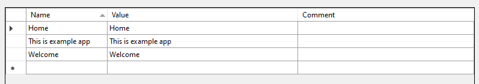

# LTR - LocalizablesToResx

LocalizablesToResx is a simple tool, which is used to acquire localized strings within `.razor` files and automatically generate `.resx` file based on these strings. This tool intends to simplify creation of .resx files from .razor files.


## Example

Let's have following .razor file with localized strings
```html

<h1>@Localizer["Home"]</h1>
<p>@Localizer["Welcome"]</p>
<p>@Localizer["This is example app"]</span>

```

Following resx file will be generated:



## Installation

dotnet tool install AXSharp.ltr --prerelease --local


## Usage

This cli tool have following parameters:

- -i (--identifier) - identifier represent localizer, which is used to locate localized strings
- -o (--)
-f
-d
-o