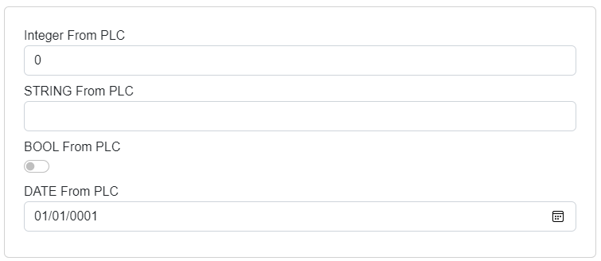

# Layouts

This file describes layouts, which are supported by Ix.Presentation.Blazor framework. 

Following layouts are supported within the framework:

- Stack
- UniformGrid
- Wrap
- Tabs
- Border
- GroupBox

Layout can by specified in PLC code with the following attribute:
```
{#ix-attr:[Container(Layout.Name)]}
```
Where *Name* is replaced with the name of one of the supported layouts.

---

## Stack
Stack is the default layout, where UI elements are placed into the stack container - they are rendered one element at a row. Stack is the default layout when a layout isn't specified.

---
## UniformGrid
UniformGrid will place elements in a row, where each element is of uniform width - so width of all elements is the same. 

Let's have the following PLC code with a container attribute:
```
{#ix-attr:[Container(Layout.UniformGrid)]}
CLASS stExample :
	VAR PUBLIC 
		testInteger : INT;
		testEnum : stTestEnum;
		testString : STRING := 'Hello World';
		testBool : BOOL;
	END_VAR  
END_CLASS
```

And this is the result:


---
## Wrap
Wrap layout will create a wrapper around the elements. It will place the elements in a row. However width of all elements isn't same and when window is resized, elements will be placed below each other. So wrap layout is responsive layout.

This is the example behavior of wrap panel:


---
## Tabs
Tabs layout will place each element in its own tab. You are able to switch between tabs to see corresponding UI. In example below, you can see PLC code with Layout.Tabs container attribute and corresponding auto-generated UI.
```
{#ix-attr:[Container(Layout.Tabs)]}
CLASS fbWorldWeatherWatch
	VAR PUBLIC   
		{#ix-set:AttributeName = "North pole station"}
		NorthPole : structWeatherStation := (StationICAO := 'CYRB');

		{#ix-set:AttributeName = "South pole station"}
		SouthPole : structWeatherStation := (StationICAO := 'NZSP');

		{#ix-set:AttributeName = "Verl, Germany"}
		Verl : structWeatherStation := (StationICAO := 'EDLP');

		{#ix-set:AttributeName = "Kriva, Slovakia"}
		Kriva : structWeatherStation := (StationICAO := 'LZIB');	
	END_VAR 
END_CLASS
 
```


---
## Border
Border layout will create border around auto-generated elements. 



---
## GroupBox
GroupBox layout will create border with name of first element around auto-generated elements. 


---
## Nested and multiple layouts
It is possible to nest multiple container attributes in PLC code to create a complex layouts.
Consider following the plc code:
```
{#ix-attr:[Container(Layout.Tabs)]}
CLASS stMultipleLayouts
	VAR PUBLIC 
		{#ix-attr:[Container(Layout.Stack)]}
		{attribute addProperty Name "A1"}
		Piston_A1 : STRING;
		{attribute addProperty Name "A2"}
		Piston_A2 : STRING;
		{attribute addProperty Name "A3"}
		Piston_A3 : STRING;
		{attribute addProperty Name "A4"}
		Piston_A4 : STRING;
		
		{#ix-attr:[Container(Layout.Wrap)]}
		{attribute addProperty Name "A5"}
		Piston_A21 : INT;
		{attribute addProperty Name "A6"}
		Piston_A22 : INT;
		{attribute addProperty Name "A7"}
		Piston_A23 : INT;
		{attribute addProperty Name "A8"}
		Piston_A24 : INT;
	END_VAR 
END_CLASS

```
You will get the following auto-generated UI:


---
