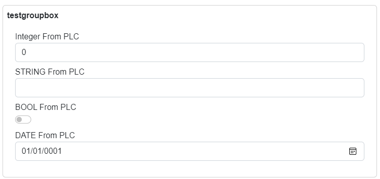

# Layouts

Layouts serves for adjustment of rendered UI.

Following layouts are supported within the framework:

- Stack
- UniformGrid
- Wrap
- Tabs

The framework also contains a special layouts for grouping purposes.

Following group layouts are supported:

- Border
- GroupBox

Layout can be specified in PLC code with the following attribute:
```
{#ix-attr:[Container(Layout.Name)]}
```
Where *Name* is replaced with the name of one of the supported layouts.

Group layouts can be used only together with layouts and are specified with following attribute:

```
{#ix-attr:[Container(GroupLayout.Name)]}
```
---

## Stack
Stack is the default layout, where UI elements are placed into the stack container - they are rendered one element at a row. Stack is the default layout when a layout isn't specified.

---
## UniformGrid
UniformGrid will place elements in a row, where each element has uniform width.
Let's have the following PLC code with a container attribute:
```
{#ix-attr:[Container(Layout.UniformGrid)]}
CLASS stExample :
	VAR PUBLIC 
		testInteger : INT;
		testEnum : stTestEnum;
		testString : STRING := 'Hello World';
		testBool : BOOL;
	END_VAR  
END_CLASS
```

Renderer will create following UI:


---
## Wrap
Wrap layout creates a wrapper around the elements. Elements are placed in a row. Width of all elements isn't the same and when window is resized, elements will be placed below each other. So wrap layout is responsive layout.

This is the example behavior of wrap panel:


---
## Tabs
Tabs layout creates tabbed interface. In example below, UI is generated in Tabs layout.
```
{#ix-attr:[Container(Layout.Tabs)]}
CLASS fbWorldWeatherWatch
	VAR PUBLIC   
		{#ix-set:AttributeName = "North pole station"}
		NorthPole : structWeatherStation := (StationICAO := 'CYRB');

		{#ix-set:AttributeName = "South pole station"}
		SouthPole : structWeatherStation := (StationICAO := 'NZSP');

		{#ix-set:AttributeName = "Verl, Germany"}
		Verl : structWeatherStation := (StationICAO := 'EDLP');

		{#ix-set:AttributeName = "Kriva, Slovakia"}
		Kriva : structWeatherStation := (StationICAO := 'LZIB');	
	END_VAR 
END_CLASS
 
```


---
## Group layout Border
Border layout will create box around auto-generated elements in specified layout. 


```
{#ix-attr:[Container(Layout.Stack)]}
{#ix-attr:[Group(GroupLayout.Border)]}   
CLASS border
    VAR PUBLIC
        {#ix-set:AttributeName = "<#Integer From PLC#>"}	
        testInteger : INT;
        {#ix-set:AttributeName = "<#STRING From PLC#>"}	
        testString : STRING;
        {#ix-set:AttributeName = "<#BOOL From PLC#>"}	
        testBool : BOOL;
        {#ix-set:AttributeName = "<#DATE From PLC#>"}
        TestDate : DATE;	
    END_VAR
END_CLASS
```


---
## Group layout GroupBox
GroupBox layout will create box with name around auto-generated elements. 

```
{#ix-attr:[Container(Layout.Stack)]}
{#ix-attr:[Group(GroupLayout.GroupBox)]}   
CLASS border
    VAR PUBLIC
        {#ix-set:AttributeName = "<#Integer From PLC#>"}	
        testInteger : INT;
        {#ix-set:AttributeName = "<#STRING From PLC#>"}	
        testString : STRING;
        {#ix-set:AttributeName = "<#BOOL From PLC#>"}	
        testBool : BOOL;
        {#ix-set:AttributeName = "<#DATE From PLC#>"}
        TestDate : DATE;	
    END_VAR
END_CLASS
```



---
## Nested and multiple layouts
Layouts can be nested to create more complex UI.

Consider following the plc code:
```
{#ix-attr:[Container(Layout.Tabs)]}
CLASS stMultipleLayouts
	VAR PUBLIC 
		{#ix-attr:[Container(Layout.Stack)]}
		{#ix-set:AttributeName = "A1"}
		Piston_A1 : STRING;
		{#ix-set:AttributeName = "A2"}
		Piston_A2 : STRING;
		{#ix-set:AttributeName = "A3"}
		Piston_A3 : STRING;
		{#ix-set:AttributeName = "A4"}
		Piston_A4 : STRING;
		
		{#ix-attr:[Container(Layout.Wrap)]}
		{#ix-set:AttributeName = "A5"}
		Piston_A21 : INT;
		{#ix-set:AttributeName = "A6"}
		Piston_A22 : INT;
		{#ix-set:AttributeName = "A7"}
		Piston_A23 : INT;
		{#ix-set:AttributeName = "A8"}
		Piston_A24 : INT;
	END_VAR 
END_CLASS

```
Renderer will generate following UI:


---
