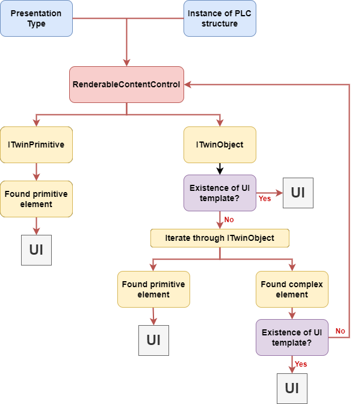
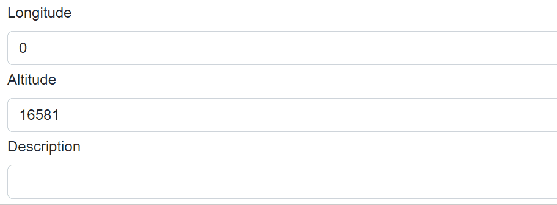

# RenderableContentControl

This file describes the purpose, features and usage of the **RenderableContentControl** component.

## Table of Contents
1. [What is RenderableContentControl?](#id-RenderableContentControl)
2. [Basic Example](#id-bacisexample)
3. [How it works](#id-howitworks)
4. [Features](#id-features)
    - [Presentation Type and Presentation pipeline](#id-presentation)
    - [RenderIgnore and custom labels](#id-renderingore)
	- [Edit property](#id-editprop)
    - [Layouts](#id-layouts)
    - [Styling](#id-styling)
    
 ---   
<!-- ----------------------------------------------------------------------------------- -->
<div id='id-RenderableContentControl'/>

## What is RenderableContentControl?

RenderableContentControl is a Blazor component, which is able to automatically generate UI from C# objects acquired within Ix Framework. 
Ix compiler will create twin C# classes of PLC classes, which instances can be pass to RenderableContentControl to generate corresponding views. 
It can render both complex objects (*ITwinObject* type) and primitive objects containing values (*ITwinPrimitive* type).
In addition, resulting UI can be adjusted with attributes from PLC code.

 ---   

<!-- ----------------------------------------------------------------------------------- -->
<div id='id-bacisexample'/>

## Basic example
Let's have following PLC structure *stExample*:
```T
CLASS stExample :
	VAR PUBLIC 
		testInteger : INT;
		testEnum : stTestEnum;
		testString : STRING := 'Hello World';
		testBool : BOOL;
	END_VAR    
END_CLASS
```
IxCompiler will create *stExample* counterpart in C#. After that, this new object can be passed as parameter to `RenderableContentControl`.
```C#
<RenderableContentControl Presentation="Control"
                          Context="@Entry.Plc.MAIN.instanceOfstExample"/>
```
We will get the following auto-generated UI:


 ---   
<!-- ----------------------------------------------------------------------------------- -->
<div id='id-howitworks'/>

## How automatic generation of UI works

Ix.Presentation.Blazor framework contains two libraries: 
- **Ix.Presentation.Blazor**
    - Base classes
    - Services 
    - Interfaces 
- **Ix.Presentation.Controls.Blazor** 
    - Styles
    - Layouts
    - UI templates of primitive types
    - *RenderableContentControl* component

The diagram below represent fundamental logic of UI generation:



- The *RenderableContentControl* accepts as parameters instance of plc structure and presentation type.
- Renderer will determine, whether input instance is of type **ITwinPrimitive** or **ITwinObject**:
    - **ITwinPrimitive:** The renderer will find a corresponding UI primitive template and then render the UI.
    - **ITwinObject:** The renderer will try to find a corresponding UI of complex template. If the complex template is found, UI will be rendered. Otherwise, **ITwinObject** will be iterated down to primitive types, which then will be rendered with primitive UI templates.

<!-- ----------------------------------------------------------------------------------- -->

---
<div id='id-features'/>

## Features

<div id='id-presentation'/>

### **Presentation types**

**Presentation types** specify mode in which UI will be rendered. Within *Ix.Presentation.Blazor* framework following presentation types are supported.
- `Display`
- `Control`
- `ShadowDisplay`
- `ShadowControl`

In the **Control** presentation type, values of rendered structure can be modified. 
On the other hand, the **Display** presentation type serves for displaying values. 
If no presentation type is specified, Display presentation type will be used.

### **Presentation pipeline**

**Presentation pipeline** is represented by a string of presentation types.
Each presentation type is separated by a dash '-'. RenderableContentControl will parse this string and will look for UI templates specified by presentation types in the pipeline. If the first presentation type is not found, it'll look for other one in the pipeline and so on... 

See the example below:

Let's add new property to the `stExample` structure. New type `IxComponent` is a component from an external library whose UI implementation is of **Manual** presentation type.

```
CLASS stExample :
	VAR PUBLIC 
		testInteger : INT;
		testEnum : stTestEnum;
		testString : STRING := 'Hello World';
		testBool : BOOL;
		testIxComponent: IxComponent;  //added property
	END_VAR    
END_CLASS
```
Let's have the following code, where we specify the presentation pipeline:
```C#
<RenderableContentControl Presentation="Manual-Control"
                          Context="@Entry.Plc.MAIN.instanceOfstExample"/>
```
Renderer will generate following UI:


Primitive types are generated in **Control** presentation type whereas IxComponent is generated in **Manual** presentation type, because Manual view have been found first.

<div id='id-renderingore'/>

### **RenderIgnore and custom labels**


Thanks to the support of custom attributes in the PLC code you can specify, which elements you want to exclude from rendering. You can also set custom names for each element. See the example below.

Let's have the following PLC code with attributes:
```
CLASS stExample :
	VAR PUBLIC 
		{#ix-set:AttributeName = "Custom label Integer"}
		testInteger : INT;

		{#ix-attr:[RenderIgnore()]}   
		testEnum : stTestEnum;

		{#ix-set:AttributeName = "Custom label String"}
		testString : STRING := 'Hello World';

		{#ix-set:AttributeName = "Custom label Bool"}
		testBool : BOOL;

		{#ix-attr:[RenderIgnore()]}   
		testIxComponent: IxComponent;
	END_VAR  
END_CLASS
```

Renderer will render following UI:


Properties *testEnum* and *testIxComponent* are ignored and the rest of the elements have custom labels.

It is possible to ignore properties only in specific presentation types:

```
{#ix-attr:[RenderIgnore("Display","ShadowDisplay")]}  
testIxComponent: IxComponent;
```
<div id='id-editprop'/>

### **Edit Property**

Then renderer binds variables to `Cyclic` or `Edit` property of an Onliner. When an element gets focus, value is bound to `Edit` property and UI updates stops. After the focus is lost, the value is bound back to `Cyclic` property and the value in the UI start updating again. 



### Renderable content control Polling 

When the twin connector is in polling mode, `RenderableContentControl` will take the parameter `PollingInterval` into consideration. The polling will start automatically when the content is rendered and will unsubscribe when it is disposed.

[More about polling here](../connectors/README.md#polling)

**Example**
```XML
<RenderableContentControl Context="@Entry.Plc.measurements" Presentation="Display" PollingInterval="1000"/>
```

<div id='id-layouts'/>

### **Layouts**
Auto-generated UI can be customized by layouts.
More information about layout is in **[LAYOUTS](LAYOUTS.md)** file.
<div id='id-styling'/>

### **Styling**
Ix.Presentation.Blazor contains in-built styles. Styling is provided by [Bootstrap library](https://getbootstrap.com/). In-built styles can be customized with Sass technology, which will produce SCSS files. SCSS files can be compiled into one CSS file which can be used as application-wide style.

Currently, the framework contains a default style that can be added as a reference in the Blazor application file *_Host.cshtml* in the following way:

```
 <link rel="stylesheet" href="/_content/IX.Presentation.Blazor.Controls/css/ix-bootstrap.min.css">
```
It is possible to add built-in javascript libraries as well:
```
    <script src="/_content/IX.Presentation.Blazor.Controls/js/ix-bootstrap.bundle.min.js"></script>
    <script src="/_content/IX.Presentation.Blazor.Controls/js/jquery-3.6.0.min.js"></script>
```
### **Custom components libraries**

Ix.Presentation.Controls framework provides possibility to create a custom library of components with corresponding views. 
When library is referenced from your Blazor project, the framework will automatically load its views, which then can be auto-generated with the RenderableContentControl component.

For more information about custom libraries and how to create them, look into **[LIBRARIES](LIBRARIES.md)** file.


---
