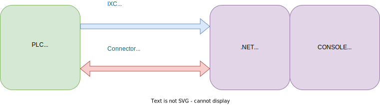
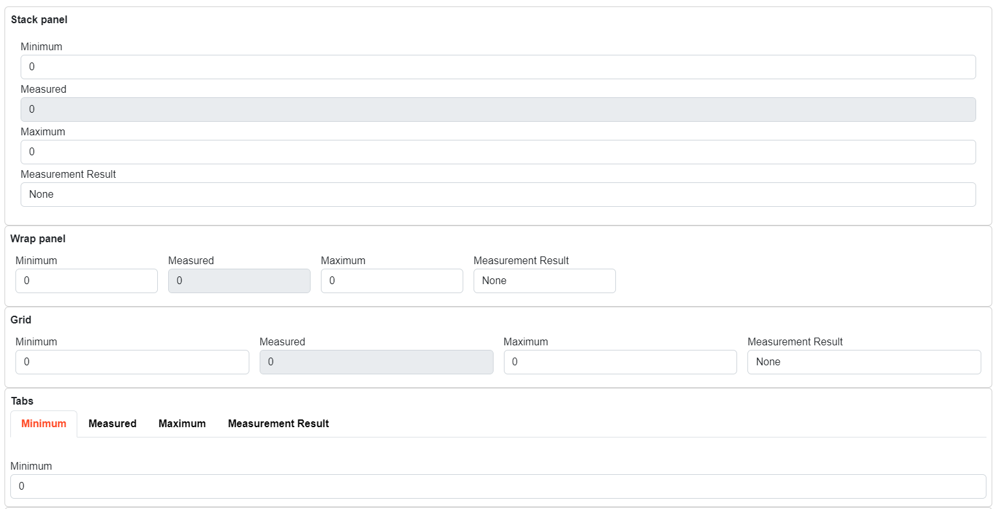

# Introduction

## .NET PLC TWINs

The core functionality of IX is to provide connectivity between SIMATIC AX based PLC project and .NET PLC TWIN objects. Twin objects replicate consistently the data structures of the PLC program, so that the access path to data members in the PLC program and in .NET environment are the same.

In the following diagram you can observe that there are two basic components `ixc` which is the compiler that trans-piles the data types into .NET library and `Connector` that provides the connectivity between the object produces by the `ixc` and the PLC.

These two mechanism of the IX technology provide the structured access to any .NET based application.

See also:
[Compiler](../compiler/README.md)

## Automated UI generation

IX provides a possibilty to automatically render the data from the PLC controller. Rendering engine provides the possibilty to direct the basic layout using attributes directly in the PLC code. There are several types of attributes that can add human readable strings that will be displayed in the UI.

Following code will be transpiled into TwinObject and rendered as follows:

~~~SmallTalk
NAMESPACE MeasurementExample
    {#ix-attr:[Container(Layout.Wrap)]}
    {#ix-attr:[Group(Layout.GroupBox)]}
    CLASS PUBLIC Measurement
        VAR PUBLIC
            {#ix-set:AttributeName = "Minimum"}
            Min : REAL;
            {#ix-set:AttributeName = "Measured"}
            {#ix-attr:[ReadOnly()]}
            Acquired : REAL;
            {#ix-set:AttributeName = "Maximum"}
            Max : REAL;
            {#ix-set:AttributeName = "Measurement Result"}
            Result : Result;        
        END_VAR    
    END_CLASS

    TYPE
        Result : INT (
            None := 0,
            Passed := 10,
            Failed := 20
        );
    END_TYPE

    CLASS PUBLIC Measurements
        VAR PUBLIC
            {#ix-attr:[Container(Layout.Stack)]}
            {#ix-attr:[Group(Layout.GroupBox)]}
            {#ix-set:AttributeName = "Stack panel"}
            measurement_stack : Measurement;

            {#ix-attr:[Container(Layout.Wrap)]}
            {#ix-attr:[Group(Layout.GroupBox)]}
            {#ix-set:AttributeName = "Wrap panel"}
            measurement_wrap : Measurement;
            
            {#ix-attr:[Container(Layout.UniformGrid)]}
            {#ix-attr:[Group(Layout.GroupBox)]}
            {#ix-set:AttributeName = "Grid"}
            measurement_grid : Measurement;
            
            {#ix-attr:[Container(Layout.Tabs)]}
            {#ix-attr:[Group(Layout.GroupBox)]}
            {#ix-set:AttributeName = "Tabs"}
            measurement_tabs : Measurement;
        END_VAR    
    END_CLASS
END_NAMESPACE
~~~

See also:

[Blazor rendering](../blazor/README.md)