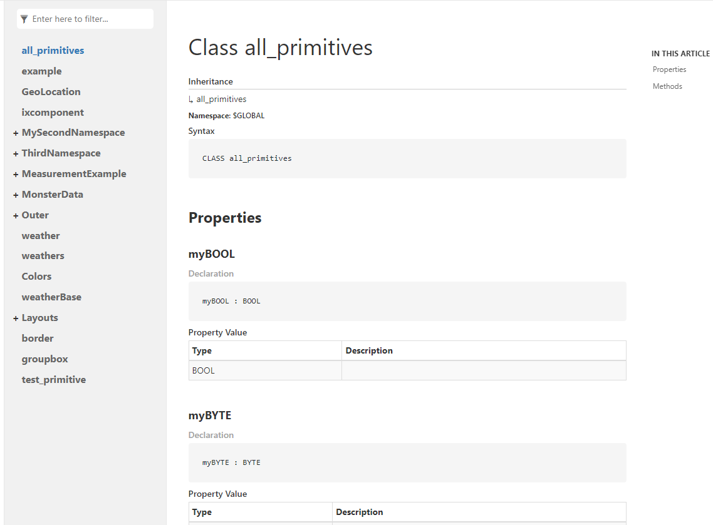

# IXD - documentation compiler for AX

Ixd is command line tool which can generate API documentation for AX projects. Ixd transpiles `.st` files to `yaml` files which can be used in [Docfx](https://github.com/dotnet/docfx) documentation tool.

## Quick start

### 1. Install latest docfx 

Enter following code in terminal:

```
dotnet tool update -g docfx
```

### 2. Create new docfx project

```
docfx init --quiet
```

Docfx project will be generated with following folder structure:
```
├───api <-- this should be output folder of ixd
├───apidoc
├───articles
├───images
├───src          
└───_site
    ├───api
    ├───articles
    ├───fonts
    └───styles
```


### 3. Generate documentation with ixd


```
ixd -x $PATH_TO_AX_PROJECT -o $PATH_TO_API_FOLDER
```

where:

`$PATH_TO_AX_PROJECT` -- is path to AX project, which contains apax.yml file
`$PATH_TO_API_FOLDER` -- is path to `api` output folder, which is located in docfx project

### 4. Build and run docfx docset

Enter following command in `docfx_project` project directory:

```
docfx docfx.json --serve
```

Now you can preview the website on http://localhost:8080/api/.

Website should look something like this:



## Notes
Ixd is still in early development, so some features may be missing and bugs may occur. 
Currently ixd can generate documentation for following elements:

- Namespaces
    - Classes
        - Methods
        - Properties
    - Interfaces
    - Types


## XML comments
Ixd supports extracting [XML comment formats](https://learn.microsoft.com/en-us/dotnet/csharp/language-reference/xmldoc/) from `.st` files into API documentation. 

Following XML tags are currently supported:

- `<summary>`
- `<params>`
- `<returns>`
- `<example>`
- `<remarks>`
- `<code>`
- `<c>`